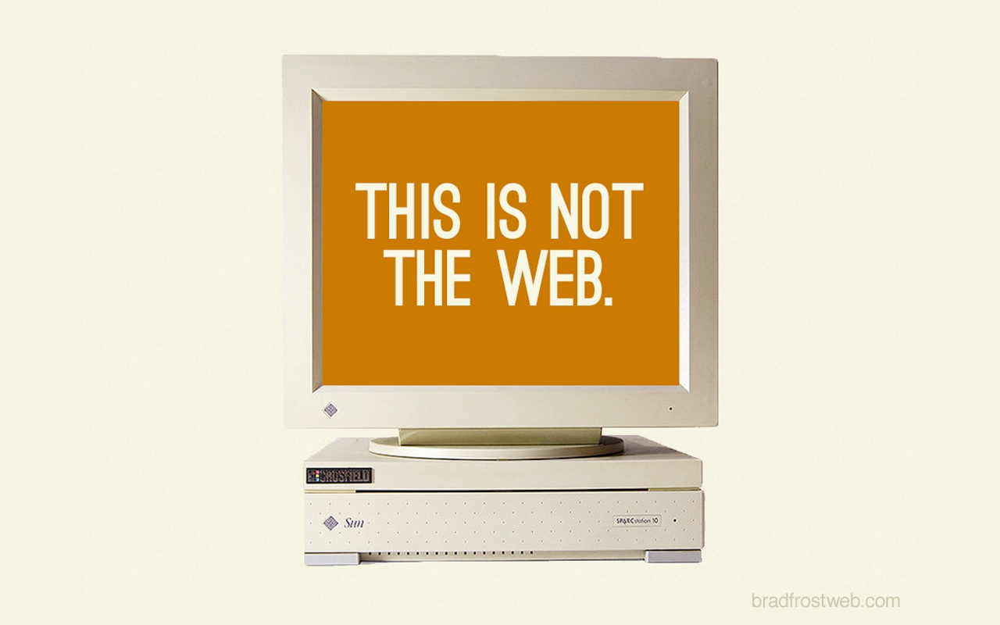
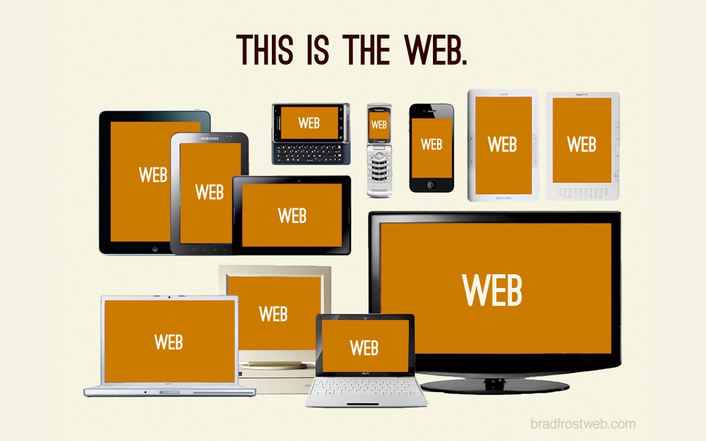
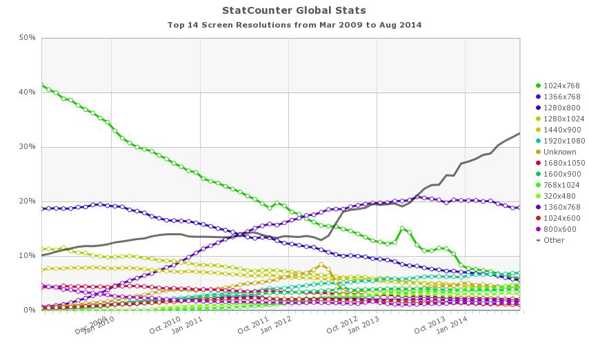
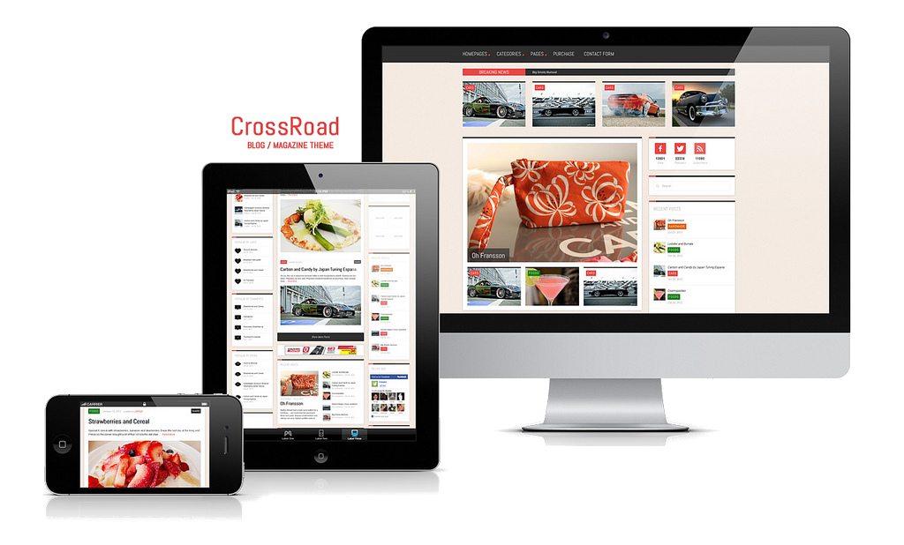
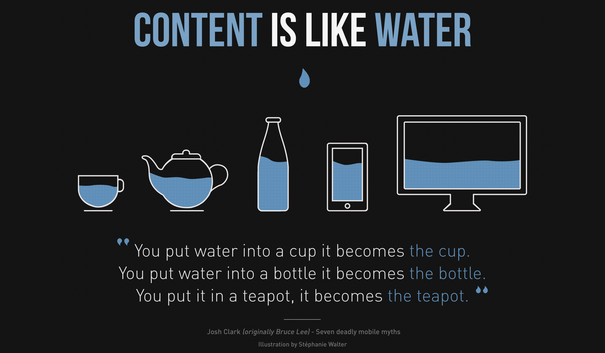
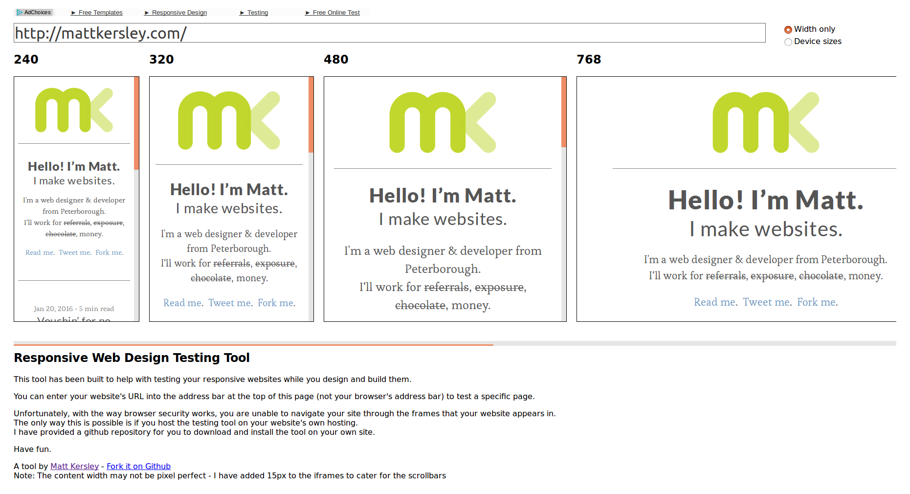
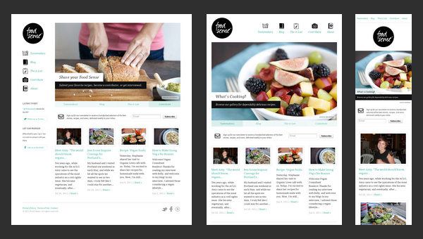
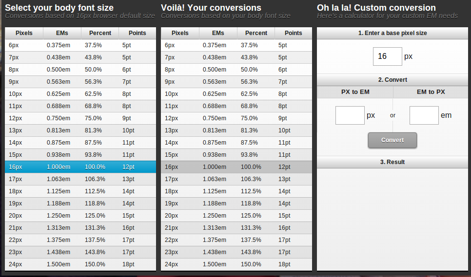
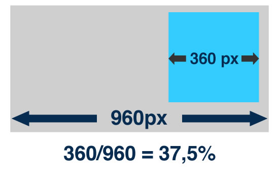
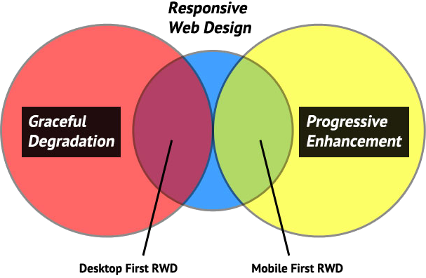

% Responsive Web Design
% Adolfo Sanz De Diego
% Septiembre 2017

# El autor

## Adolfo Sanz De Diego

- Empecé **desarrollando aplicaciones web**, hasta que di el salto a la docencia.

- Actualmente soy **Asesor Técnico Docente** en el servicio TIC de la D.G de Infraestructuras y Servicios de la Consejería de Educación, Juventud y Deporte de la Comunidad de Madrid.

- Además colaboro como **formador especializado en tecnologías de desarrollo**.

## Algunos proyectos

- **Hackathon Lovers** <http://hackathonlovers.com>: un grupo creado para emprendedores y desarrolladores amantes de los hackathones.

- **Password Manager Generator** <http://pasmangen.github.io>: un gestor de contraseñas online.

- **MarkdownSlides** <https://github.com/asanzdiego/markdownslides>: un script para crear slides a partir de ficheros MD.

## ¿Donde encontrarme?

- Mi nick: **asanzdiego**

    - AboutMe:  <http://about.me/asanzdiego>
    - GitHub:   <http://github.com/asanzdiego>
    - Twitter:  <http://twitter.com/asanzdiego>
    - Blog:     <http://asanzdiego.blogspot.com.es>
    - LinkedIn: <http://www.linkedin.com/in/asanzdiego>
    - Google+:  <http://plus.google.com/+AdolfoSanzDeDiego>

# Introducción

## Esto no es la web

## Esto es la web

## ¿Será esto la web?

## Estadísticas

## El desarrollador

## Responsive Web Design

## Content is like water

## Graceful degradation

- Se **desarrolla para los últimos navegadores**, con la posibilidad de que funcione en navegadores antiguos.

## Progessive enhancement

- Se **desarrolla una versión básica** completamente operativa, con la posibilidad de ir añadiendo mejoras para los últimos navegadores.

## Beneficios (I)

- **Reducción de costos**. Pues no hay que hacer varias versiones de una misma página.

- **Eficiencia en la actualización**. El sitio solo se debe actualizar una vez y se ve reflejada en todas las plataformas.

- **Mejora la usabilidad**. El usuario va a tener experiencias de usuario parecidas independientemente del dispositivo que esté usando en cada momento

## Beneficios (II)

- **Mejora el SEO**. Según las Guidelines de Google el tener una web que se vea correctamente en móviles es un factor que tienen en cuenta a la hora de elaborar los rankings.

- **Impacto en el visitante**. Esta tecnología por ser nueva genera impacto en las personas que la vean en acción, lo que permitirá asociar a la marca con creatividad e innovación.

# Ejemplos

## Matt Kersley

- <http://mattkersley.com/responsive>

## dConstruct 2011

- <http://2011.dconstruct.org>

## Boston Globe

- <http://www.bostonglobe.com>

## Food Sense

- <http://foodsense.is>

## Deren Keskin

- <http://www.deren.me>

# Diseño fluido

## De PX a EM

- Formula: **target ÷ context = result**

    - target - font-size que tenemos en píxeles
    - context - font-size base (por defecto 16px en la mayoría de los navegadores)
    - result - resultado que obtenemos en em

- Es recomendable indicar el cálculo realizado junto a la regla de CSS.

## On Line

- <http://pxtoem.com>

## Ejemplo

- Ejemplo para poner 13px por defecto y luego 18px para h1 en em:

~~~
body {
  font: 13px;
}

h1 {
  font-size: 1.3846 em;
  /* 18px/13px = 1.3846em */
}
~~~

## EM se hereda

- Importante: **las medidas em se heredan**, es decir, un elemento dentro de un elemento tomará como referencia el superior para calcular cuánto es un em.

- Por ejemplo, si tenemos una caja donde hemos definido una fuente como 0.5em y dentro de esa caja otra con una fuente 0.25em, esta última fuente tendrá 1/4 de tamaño respecto a la 1/2 de tamaño de la fuente general.

## De PX a %

# Sistema de rejilla

## Ejemplo

- 1 columna para xs (\<768px)
- 2 columnas para sm (≥768px)
- 3 columnas para md (≥992px)
- 4 columnas para lg (≥1200px)

## Uso de clases

- Uso de clases en el HTML como **Bootstrap**
    - <http://getbootstrap.com/css>

## Ejemplo Bootstrap

~~~

  
1

  
2

  
3

  
4

~~~

## Semántico

- **The Semantic Grid System**: Mediante layouts, y sin necesidad de usar clases en HTML.
    - <http://semantic.gs>

## Ejemplo semantic.gs (HTML)

~~~
<header>...</header>
<article>...</article>
<aside>...</aside>
~~~

## Ejemplo semantic.gs (CSS)

~~~
@column-width: 60;
@gutter-width: 20;
@columns: 12;

header { .column(12); }
article { .column(9); }
aside { .column(3); }

@media (max-device-width: 960px) {
  article { .column(12); }
  aside { .column(12); }
}
~~~

# Imágenes fluidas

## Tamaño máximo

- Fijar un **tamaño máximo** (si la imagen no llega, se queda con su tamaño):

~~~
img {
  max-width:400px;
}
~~~

## Ancho del contenedor (I)

- Ocupar el **ancho del contenedor** (si la imagen no llega, se deforma):

~~~
img {
  width:100%;
}
~~~

## Ancho del contenedor (II)

- Ocupar el **ancho del contenedor** (si la imagen no llega, se queda con su tamaño):

~~~
img {
  max-width:100%;
}
~~~

## Ancho del contenedor (III)

- Ocupar el **ancho del contenedor hasta un máximo** (si la imagen no llega, se deforma):

~~~
img {
  width:100%;
  max-width:400px;
}
~~~

## Backgrounds

- Para los background usar **cover**

~~~
.background-fluid {
  width: 100%;
  background-image:
    url(img/water.jpg);
  background-size: cover;
}
~~~

# Viewport

## Orígenes

- La etiqueta meta para el viewport fue **introducida por Apple** en Safari para móviles en el año 2007, para ayudar a los desarrolladores a mejorar la presentación de sus aplicaciones web en un iPhone.

- Hoy en día ha sido **ampliamente adoptada por el resto de navegadores móviles**, convirtiéndose en un estándar de facto.

## ¿Qué nos permite?

- La etiqueta viewport nos permite definir el **ancho, alto y escala del área** usada por el navegador para mostrar contenido.

## Tamaño

- Al fijar el ancho (width) o alto (height) del viewport, **podemos usar un número fijo de pixeles** (ej: 320px, 480px, etc) **o usar dos constantes, device-width y device-height** respectivamente.

- Se considera una **buena práctica configurar el viewport con device-width y device-height**, en lugar de utilizar un ancho o alto fijo.

## Escala

- La propiedad **initial-scale** controla el nivel de zoom inicial al cargarse la página.

- Las propiedades **maximum-scale, minimum-scale** controlan el nivel máximo y mínimo de zoom que se le va a permitir usar al usuario.

- La propiedad **user-scalable [yes|no]** controlan si el usuario puede o no hacer zoom sobre la página.

## Accesibilidad

- Es una **buena práctica de accesibilidad no bloquear las opciones de zoom** al usuario.

## Ejemplo

- Un ejemplo adaptable y accesible sería:

~~~
<meta name="viewport"
  content="width=device-width,
    initial-scale=1,
    user-scalable=yes">
~~~

# Media Queries

## ¿Qué son?

Un Media Query **no sólo nos permite seleccionar el tipo de medio** (all, braille, print, proyection, screen, tty, tv, etc.), **sino además consultar otras características** sobre el dispositivo que esta mostrando la página.

## Ejemplo

- **Ejemplo**: aplicar distintas reglas CSS cuando el área de visualización sea mayor que 480px.

## Distintos CSS

- Solución 1: **cargar distintas CSS**:

~~~
<link rel="stylesheet"
  type="text/css"
  media="all and (min-width: 480px)"
  href="tablet.css" />

<!-- tablet.css es un CSS con reglas para cuando el área de visualización sea mayor que 480px -->
~~~

## Mismo CSS

- Solución 2: **definir distintas propiedades dentro del mismo CSS**:

~~~
@media all and (min-width: 480px) {

  /* aquí poner las reglas CSS
  para cuando el área de visualización
  sea mayor que 480px*/
}
~~~

## Importar CSS

- Solución 3: **importar distintas hojas de estilo dentro del mismo CSS**:

~~~
@import url("tablet.css")
  all and (min-width: 480px);

  /* tablet.css es un CSS con reglas
  para cuando el área de visualización
  sea mayor que 480px */
}
~~~

## Operador and

- Es usado para combinar múltiples media features en un sólo Media Query, **requiriendo que cada función devuelve true** para que el Query también lo sea.

## Ejemplo and

~~~
@media tv
  and (min-width: 700px)
  and (orientation: landscape) {

  /* reglas que queremos que
  se apliquen para televisiones
  con áreas de visualización
  mayores de 700px siempre que
  la pantalla esté en
  modo landscape */
}
~~~

## Operador 'or'

- Se pueden combinar múltiples Media Queries **separados por comas** en una lista, de tal forma que si alguna de las Media Queries devuelve true, todo la sentencia devolverá true.

- Esto es **equivalente a un operador or**.

- Cada Media Query separado por comas en la lista se trata individualmente.

## Ejemplo 'or'

~~~
@media tv,
  (min-width: 700px),
  (orientation: landscape) {

  /* reglas que queremos que
  se apliquen para televisiones,
  o para dispositivos con áreas
  de visualización mayores
  de 700px, o cuando la pantalla
  está en modo landscape */
}
~~~

## Operador not

- Se utiliza para **negar un Media Query completo**.

- No se puede negar una característica individualmente, si no solamente el Media Query completo.

## Ejemplo not (I)

~~~
@media not tv and max-width(800px),
  not screen and max-width(400px) {

  /* reglas que queremos que
  se apliquen para dispositivos
  que no sean ni televisiones
  con áreas de visualización
  menores de 800px, ni pantallas
  con áreas de visualización
  menores de 400px */
}
~~~

## Ejemplo not (II)

- El anterior ejemplo sería equivalente a:

~~~
@media not (tv and max-width(800px)),
  not (screen and max-width(400px)) {

  ...
}
~~~

## Características (I)

- Características que hacen referencia al **área de visualización**:

    - **width**
    - **height**
    - **aspect-ratio** [4/3 | 16/9 | ...]
    - **orientation** [portrait | landscape]

## Características (II)

- Características que hacen referencia a la **pantalla del dispositivo**:

    - **device-width**
    - **device-height**
    - **device-aspect-ratio** [4/3 | 16/9 | ...]

## Características (III)

- **Otras** características:

    - **color**: El número de bits de profundidad de color
    - **monocrome**: El número de bits de profundidad de color, en dispotivos monocromáticos
    - **resolution**: Densidad de pixels en el dispositivo, medido en dpi

## Min- y Max-

- A casi todas las características se les puede adjuntar los **prefijos min- y max-**

- De hecho lo habitual es usar dichos prefijos.

# Metodologías

## Desktop VS Mobile

## Desktop First

- Consiste en **desarrollar para pantallas grandes** y posteriormente adaptar el diseño a pantallas pequeñas.

## DF: utiliza max-width

- Normalmente los Media Queries utilizan **max-width**, simplificando y ajustando para las pantallas más pequeñas.

~~~
@media all and (max-width: 320px) {
   /* Estilos para anchos
   menores a 320px */
}
@media all and (max-width: 768px) {
  /* Estilos para anchos
  menores a 768px */
}
~~~

## DF: problemas

- Los Media Query **no están soportados por todos los móviles**.

- La **versión móvil termina siendo una versión descafeinada** de la web original.

## Mobile first

- Consiste en **desarrollar para pantallas pequeñas** y posteriormente adaptar el diseño a pantallas grandes.

## MF: utiliza min-width

- Ahora los Media Queries utilizan **min-width**, para ajustar el diseño a medida que aumenta el tamaño de pantalla.

~~~
@media all and (min-width: 320px) {
  /* Estilos para anchos
  superiores a 320px */
}
@media all and (min-width: 768px) {
  /* Estilos para anchos
  superiores a 768px */
}
~~~

## MF: ventajas

- Funciona en **móviles y/o navegadores antiguos** que no soportan los Media Queries.

- Normalmente la **hoja de estilos resultante suele ser más sencilla** que usando la otra vía.

- Empezar por el móvil nos servirá para **determinar de una manera más clara cual es el contenido realmente importante** de nuestra web.

## Puntos de rotura (I)

- Normalmente:
    - 320px para el móvil,
    - 768px para el tablet,
    - 1024px para el portatil,
    - 1200px para el sobremesa.

## Puntos de rotura (II)

- Lo mejor sería que los puntos de rotura que aplicamos en los Media Query, fueran **en función de nuestro contenido**, en vez de en función del tamaño del dispositivo más vendido.

- La manera de hacerlo: **ir cambiando poco a poco el ancho del navegador y donde la web se rompa**, aplicar un Media Query.

# Acerca de

## Licencia

- Estas **transparencias** están hechas con:
    - MarkdownSlides: <https://github.com/asanzdiego/markdownslides>

- Estas **transparencias** están bajo una licencia Creative Commons Reconocimiento-CompartirIgual 3.0:
    - <http://creativecommons.org/licenses/by-sa/3.0/es>

## Fuentes

- Transparencias:
    - <https://github.com/asanzdiego/curso-interfaces-web-2017/tree/master/03-rwd/slides>

- Ejercicios:
    - <https://github.com/asanzdiego/curso-interfaces-web-2017/tree/master/03-rwd/src>

## Bibliografía (I)

- Responsive Web Design
    - <http://www.arkaitzgarro.com/responsive-web-design/index.html>

- Introducción al Diseño Web Adaptable o Responsive Web Design
    - <http://www.emenia.es/diseno-web-adaptable-o-responsive-web-design>

- Tutorial: Responsive Web Design
    - <http://www.mmfilesi.com/blog/tutorial-responsive-web-design-i>

## Bibliografía (II)

- Tutorial: Transforma tu web en Responsive Design
    - <http://blog.ikhuerta.com/transforma-tu-web-en-responsive-design>

- Curso responsive web design - Redradix School
    - <http://www.slideshare.net/Redradix/curso-responsive-web-design-redradix-school>

- Todo lo que necesita saber sobre Responsive Web Design
    - <http://www.ecbloguer.com/marketingdigital/?p=2635>

## Bibliografía (III)

- Diseño web fluido y plantilla fluida con HTML5 y CSS3
    - <http://www.aloud.es/diseno-web-fluido-y-plantilla-fluida>

- Beneficios del Responsive Web Design en SEO
    - <http://madridnyc.com/blog/2013/01/29/beneficios-del-responsive-web-design-en-seo>

- Responsive Web Design Testing Tool
    - <http://mattkersley.com/responsive>

## Bibliografía (IV)

- Responsive Web Design
    - <http://www.ricardocastillo.com/rwd.pdf>

- Responsive Design y accesibilidad. Buenas y malas prácticas. Errores comunes.
    - <http://olgacarreras.blogspot.com.es/2014/01/responsive-design-y-accesibilidad.html>

- Diseño web adaptativo: mejores prácticas
    - <http://www.emenia.es/diseno-web-adaptativo-mejores-practicas>

## Bibliografía (V)

- Traducción de "Responsive Web Design" de "A List Apart"
    - <http://diseñowebresponsivo.com.ar>

- Responsive Design Exercise
    - <http://blog.garciaechegaray.com/2013/11/29/responsive-design-exercise.html>

## Bibliografía (VI)

- Estadísticas de StatCounter
    - <http://gs.statcounter.com>

- Página de testeo de Matt Kersley
    - <http://mattkersley.com/responsive>

## Bibliografía (V)

- Los 5 patrones del Responsive Design con FlexBox
    - <https://carlosazaustre.es/blog/los-5-patrones-del-responsive-design/>

- El futuro del CSS Grid Layout
    - <https://carlosazaustre.es/blog/css-grid-layout-css/>

- El gran poder de CSS3: FlexBox
    - <https://filisantillan.com/el-gran-poder-de-css3-flexbox/>
